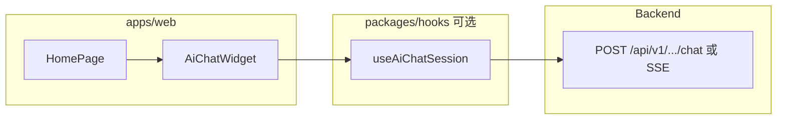

# AI 问答（首页聊天窗口）开发计划

本文档在 [REQUIREMENTS.md](./REQUIREMENTS.md) 基础上，给出实现拆分、技术要点、与当前 monorepo 的落位建议及里程碑。接口细节以 OpenAPI 为准。

---

## 1. 技术前提

| 项 | 建议 |
|----|------|
| 前端栈 | 现有 `apps/web`：React 18、Vite、antd、Tailwind、`usehooks-ts`、`zod` |
| 复用包 | UI 壳可放 `packages/ui`（如 `AiChatWidget`）；纯逻辑可放 `packages/hooks`（如 `useAiChatSession`） |
| HTTP | 延续 `createApiClient` 或独立 `fetch` + `zod` 校验响应；若需流式再封装 `EventSource` / `fetch` + `ReadableStream` |
| 类型与校验 | 请求/响应用 `zod` schema；错误解析复用 `@repo/utils` 的 `formatFastApiDetail` |
| 文档与契约 | 后端提供 OpenAPI 后，可增设 `packages/api-client` 生成或手写最小类型 |

---

## 2. 架构概要



- **组件边界**：`AiChatWidget` = 浮标 + 面板 + 消息列表 + 输入区 + 快捷问题；内部状态或交给 hook。
- **数据流**：消息列表 `Message[]`（`id`、`role`、`content`、`status?`、`createdAt`）；发送时 optimistic UI 可选。

---

## 3. 开发阶段

### 阶段 A：接口契约与 Mock（0.5–2 天）

- 与后端对齐 **路径、方法、鉴权**（Bearer 可选）、请求体字段（`messages` / `conversation_id` 等）。
- 用 **MSW** 或 Vite 简易 **mock 路由** 返回固定 JSON，便于 UI 并行。
- 定义 `zod`：`ChatRequestSchema`、`ChatResponseSchema`（或流式事件 schema 后续再加）。

**产出**：`apps/web/src/schemas/ai-chat.ts`（或 `packages/…`）、Mock 开关（`import.meta.env`）。

### 阶段 B：UI 骨架（1–3 天）

- 浮标：`fixed` 定位、`z-index`、antd `FloatButton` 或自定义 Button + 图标（`@ant-design/icons`）。
- 面板：`antd` `Drawer` / 自定义 `div` + `Card`；顶栏/关闭/滚动消息区布局。
- 快捷问题：`Space` + `Button`/`Tag` 样式 chip。
- 输入区：`Input.TextArea` + 发送；禁用/loading 状态。
- **无障碍**：`aria-label`、`Esc` 关闭（可选）、焦点陷阱（可选，二期）。

**产出**：首页可挂载的 `AiChatWidget`，无真实 AI 也能完整点通。

### 阶段 C：联调与消息状态机（2–4 天）

- 接入真实 API；处理 **401**（与全局 `useWebApi` 策略一致：清 Token + 跳转登录，或面板内提示）。
- **重试**、**超时**、**取消**（`AbortController`）策略写清。
- 消息状态：`sending` / `sent` / `failed`；失败可重发。

**产出**：端到端可走通问答；与 [FRONTEND_API.md](../FRONTEND_API.md) 错误格式对齐。

### 阶段 D：体验增强（按需，各 1–3 天）

- **流式输出**：SSE 或 chunked JSON；UI 逐段追加 `assistant` 消息。
- **持久化**：`sessionStorage` 序列化消息列表 + `conversation_id`；刷新恢复策略按 [REQUIREMENTS.md](./REQUIREMENTS.md) §6.2。
- **快捷问题配置化**：环境变量或后端 `GET /config`。
- **速率限制 UI**：429 时展示「请稍后再试」与倒计时（若后端返回 `Retry-After`）。

### 阶段 E：测试与发布（1–2 天）

- 组件级：`Vitest` + Testing Library（消息渲染、发送禁用、关闭打开）。
- E2E（可选）：Playwright 点击浮标 → 发送 → 断言回复区。
- 构建体积：考虑 `lazy` + `Suspense` 加载聊天模块（首页首屏优化）。

---

## 4. 目录与命名建议

```
apps/web/src/
  features/ai-chat/
    ai-chat-widget.tsx      # 组合浮标 + 面板
    chat-panel.tsx
    chat-message-list.tsx
    quick-replies.tsx
    use-ai-chat.ts          # 或迁至 packages/hooks
  schemas/ai-chat.ts
```

若抽象稳定，再将展示组件下沉到 `packages/ui`，hooks 下沉到 `packages/hooks`。

---

## 5. 风险与依赖

| 风险 | 缓解 |
|------|------|
| 后端接口未定时 | 阶段 A Mock 先行；前端以 schema 为单源真相 |
| 流式与 antd 渲染性能 | 大消息列表虚拟滚动（`rc-virtual-list` 或二期） |
| 浮标与首页背景对比度 | Token 色或加描边/阴影；在 `banner` 上实测 |
| 安全 | 密钥不落前端；用户输入转义防 XSS（React 默认 + Markdown 若引入需消毒） |

---

## 6. 与需求文档的追踪

| 需求章节 | 开发阶段 |
|----------|----------|
| §4.1 入口 | B |
| §4.2 面板 | B |
| §4.3 对话与 AI | A、C、D |
| §4.4 合规文案 | B（静态文案） |
| §5 验收 | E |

---

## 7. 文档索引

| 文档 | 用途 |
|------|------|
| [REQUIREMENTS.md](./REQUIREMENTS.md) | 需求说明与验收 |
| [DEV_PLAN.md](./DEV_PLAN.md) | 本文：开发计划 |
| [../FRONTEND_DEV_PLAN.md](../FRONTEND_DEV_PLAN.md) | 全仓前端工程约定 |
| [../FRONTEND_API.md](../FRONTEND_API.md) | HTTP API 参考 |
| [../FRONTEND.md](../FRONTEND.md) | 对接总览与工程说明 |

---

*里程碑日期由项目组按人力填写；接口变更请同步 OpenAPI 与本目录文档。*
